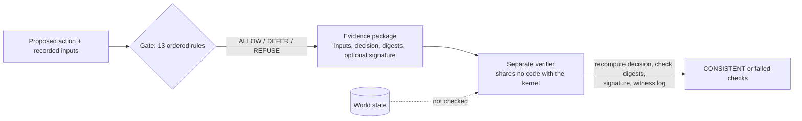

# Sovereign Veritas

<!-- 30s-demo -->
> **Status labels used below.** **PROTOTYPE:** runs, is tested, and is not hardened for production.
> **RESEARCH HYPOTHESIS:** stated, not yet shown. **NOT PRODUCTION-READY:** nothing in this repository is.

**Headline (measured):** a package whose authorization was revoked *and whose digests were all
resealed* still fails verification, because the verifier recomputes the Gate's decision from the
recorded inputs (`gate_replay`). A full verify takes about 125–143 ms on a container, Python
start-up included.

### 30-second demo — PROTOTYPE

```bash
git clone https://github.com/holland202/sovereign-veritas && cd sovereign-veritas
python tools/demo_30s.py          # standard library only; exit 0 only if every line is as expected
```

Output on x86_64, Python 3.11 (2026-09-30), pasted as printed:

```
    gate decision with a declared runtime state: ALLOW
ok  1 genuine package                            exit 0  VERDICT  CONSISTENT  freshness=NOT_PROVEN  authenticity=NOT_PROVEN  (133 ms)
    gate decision with no runtime state:          REFUSE ['runtime_state_unavailable']
ok  2 policy edited, not resealed                exit 1  VERDICT  1 check(s) failed  freshness=NOT_PROVEN  authenticity=NOT_PROVEN  failed: package_digest  (131 ms)
ok  3 authorization revoked, digests resealed    exit 1  VERDICT  1 check(s) failed  freshness=NOT_PROVEN  authenticity=NOT_PROVEN  failed: gate_replay  (137 ms)
    verifier wall time, genuine package, 5 runs (incl. Python start): min 125 ms, max 143 ms
DEMO PASS
```

### Negative results, up front

- **A fully consistent rewrite verifies.** If an attacker changes the inputs *and* the decision
  together and reseals the package, it passes. CONSISTENT means the package agrees with itself and
  with the Gate's rules. It does not mean the recorded world state is true.
- **A slow GPS spoof walked a simulated ArduCopter 61 m outside its fence while every check passed**
  (V11, [docs/VEHICLE_ACTION.md](docs/VEHICLE_ACTION.md)).
- **\"PASS\" and \"authorized\" are labels the caller writes.** An external review filed eleven breaks
  ([issue #4](https://github.com/holland202/sovereign-veritas/issues/4)). Two are fixed; the rest are
  assigned to `sv.gate/1`.
- **No second, independent implementation exists yet.** The kernel and the verifier agree on all 4690
  vectors, but both were written by one author.



### Why this is not just cryptographic logging, policy checks, or local inference

- **Not just logging.** A signed log proves that an entry was not changed. The verifier here also
  *recomputes the decision* from the recorded inputs, so a resealed entry with a changed input fails
  (case 3 above). A signature alone would not catch that, because the attacker resealed.
- **Not just a policy engine.** Cedar or OPA can make the ALLOW/DEFER/REFUSE decision; they are the
  closer comparison, and for the decision alone they are more mature. What is added here is a portable
  package that a separate program can re-check offline, plus 4690 conformance vectors that any second
  implementation can be scored against.
- **Not local inference.** No model runs in the Gate. A model's output is one input, and it is labelled
  as an observation, not proof.
- **Where it is no better than those tools:** it cannot tell a true input from a false one (see the
  negative results above).
<!-- /30s-demo -->

A fail-closed permission gate for AI actions. Before an action runs, the Gate decides
ALLOW, DEFER or REFUSE, and the decision can be written into an evidence package that a
separate verifier, sharing no code with this package, rebuilds and checks from the file alone.

Developed and run on a Galaxy S25 in Termux. Standard library only. The kernel makes no network
calls and has no telemetry; one optional red-team tool (below) calls NVIDIA's API when you run it.

## Try it — about 5 minutes, Python 3.10+

```bash
git clone https://github.com/holland202/sovereign-veritas
cd sovereign-veritas
python -m pip install -e ".[test]"
python -m pytest -q
python tools/make_package.py --thermal-status normal
# Copy the package path printed above, then run:
python tools/verify_package.py /path/to/the/package.json
```

Use `python3` if that is your interpreter. Full measurement tables, signing, witness, contract vectors, and tool map remain in this README and under `docs/`.

## License and credit

MIT. You may use, change, share and sell this, including commercially, on one condition: keep the
copyright notice (`Copyright (c) 2026 Chad Holland`) and the license text with every copy or
substantial portion. That is the credit the license requires.

If you use Sovereign Veritas in work you publish — a paper, a product, a post — please also cite
it. GitHub's **Cite this repository** button gives the format (from `CITATION.cff`).

